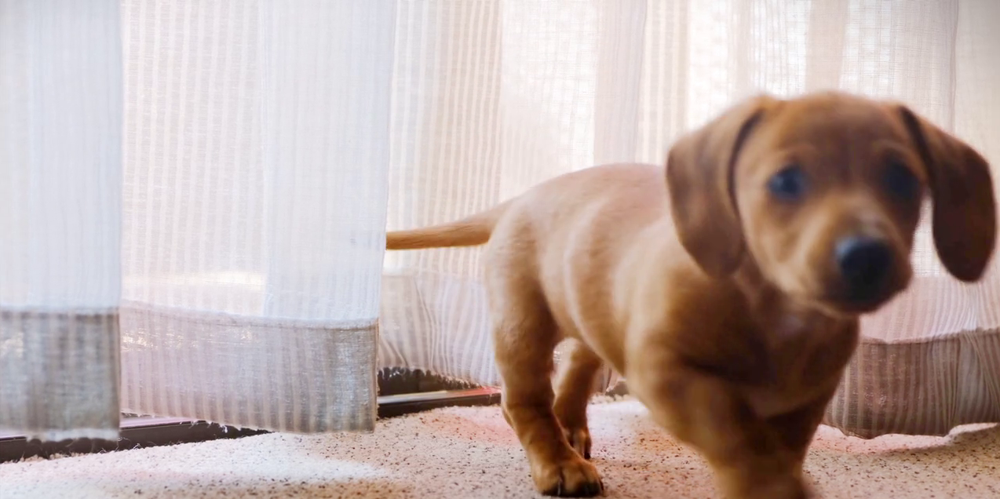
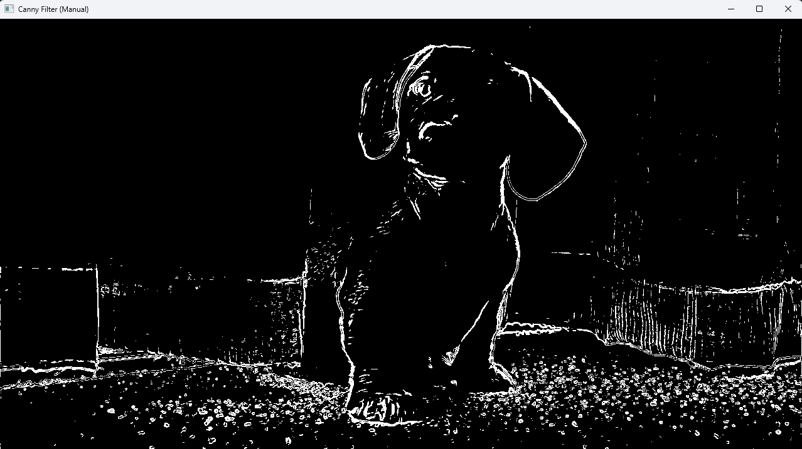
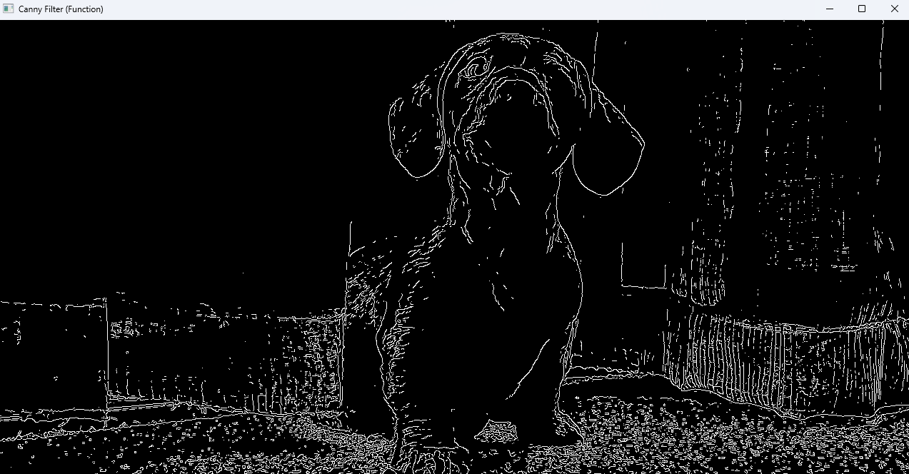

# Retos_Vision
## Mini Retos 2 y 4  correspondientes al Modulo de Vision Computacional

### MiniReto 2 Manual Canny Edges
#### Comparacion de los resultados al aplicar Filtro Canny Edges Manual y con funcion de OpenCV a un video

Imagen Original

Resultado Filtro Canny Edges Manual

Resultado Filtro Canny Edges OpenCV

---

### MiniReto 4 Robot Quasiestatico con Hand Tracking

Link a videos de los resultados obtenidos

[Prueba Con Teclado](https://youtu.be/5oaEJq3YHAQ)

[Prueba Con Hand Tracking](https://youtu.be/Ok4WW4w-qKU)
